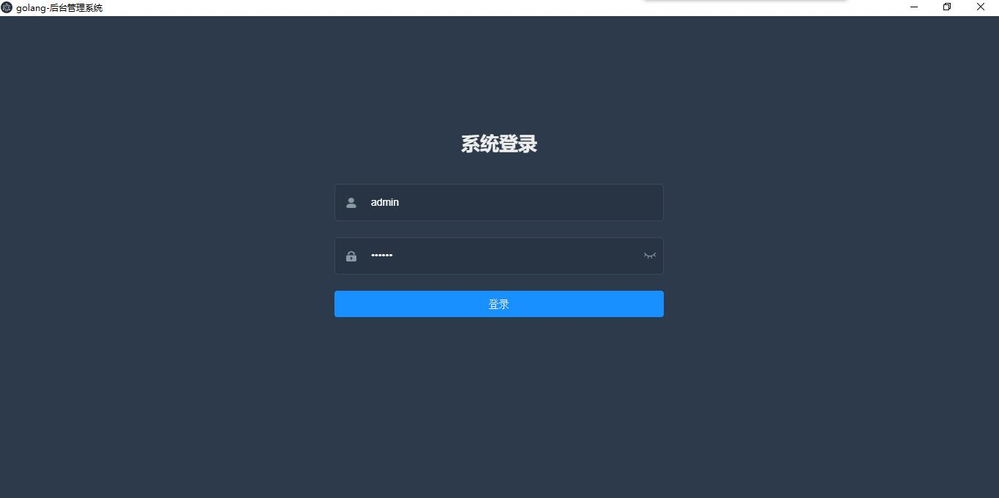
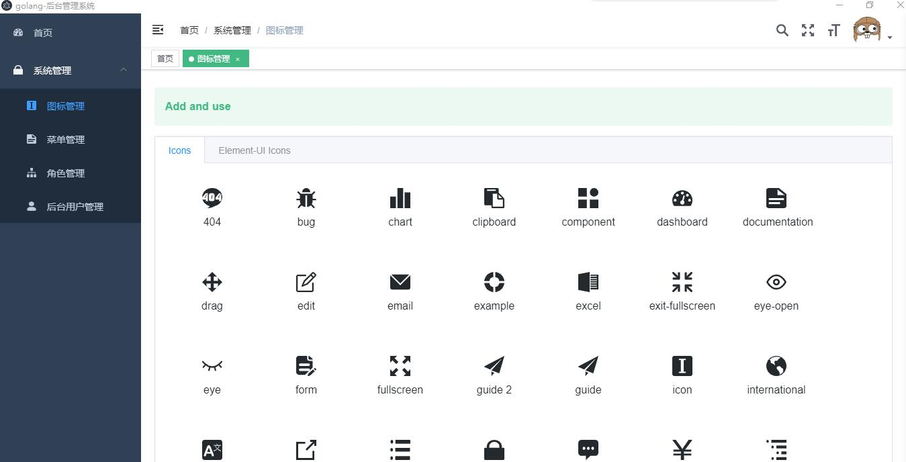
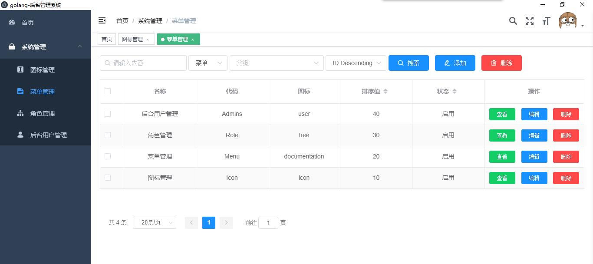
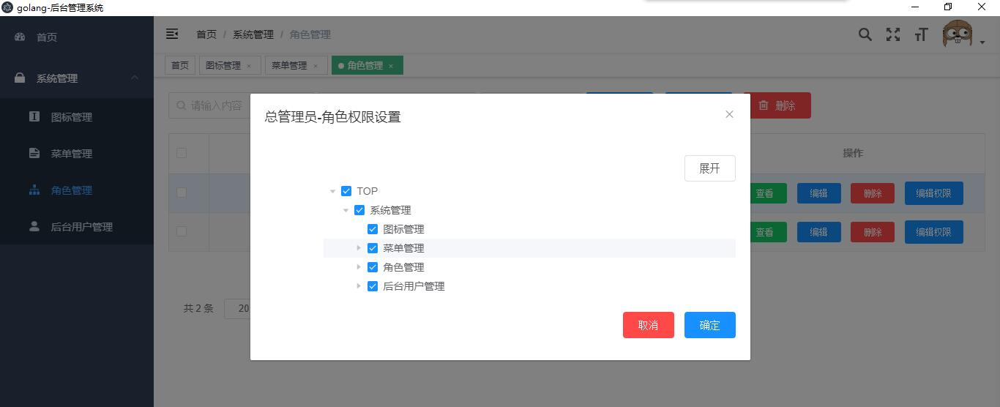
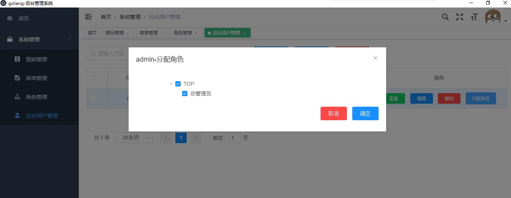

<h1>ginadmin</h1>
fork from github.com/it234/goapp

<div>
 基于 Gin + GORM + Casbin + vue-element-admin 实现的权限管理系统 <br/>
 基于Casbin 实现RBAC权限管理 <br/>
 前端实现： vue-element-admin <br/>
 在线体验：http://35.241.100.145:5315 <br/>
</div>
<br/>

## 特性

- 基于 Casbin 的 RBAC 访问控制模型
- JWT 认证
- 前后端分离

## 下载并运行

### 获取代码

```
git clone https://github.com/helight/ginadmin
```

### 运行

- 运行服务端：cd main; make; ./admin，运行成功后打开 127.0.0.1:8080，如果是在windows下操作，需要提前安装并配置好mingw（sqlite的操作库用到），安装方式请自行百度/谷歌。
- 调试/运行web：cd website/manageweb，npm install，npm run dev
- 配置文件在(`main/config.yaml`)中，用户默认为：admin/123456


#### 温馨提醒

1. 默认配置采用的是 sqlite 数据库，数据库文件(`自动生成`)在`main/data/goapp.db`。如果想切换为`mysql`或`postgres`，请更改配置文件，并创建数据库（表会自动创建）。
2. 日志的配置为标准输出并写入文件。

## 前端实现

- website/manageweb：基于[vue-element-admin](https://github.com/PanJiaChen/vue-element-admin)的实现版本

## 项目结构概览

<details>
<summary>展开查看</summary>
<pre><code>.
├── main  项目的主要应用
├── main/pkg  外部应用程序可以使用的库代码
├── vendor  项目依赖的其他第三方库
├── website  vue-element-admin
</code></pre>
</details>


## 界面截图

<details>
<summary>展开查看</summary>
<pre><code>.
<br/><br/>
<br/><br/>
<br/><br/>
<br/><br/>
<br/><br/>
</code></pre>
</details>


## 感谢以下框架的开源支持

- [Gin] - [https://gin-gonic.com/](https://gin-gonic.com/)
- [GORM] - [http://gorm.io/](http://gorm.io/)
- [Casbin] - [https://casbin.org/](https://casbin.org/)
- [vue-element-admin] - [https://github.com/PanJiaChen/vue-element-admin/](https://panjiachen.github.io/vue-element-admin/)


## MIT License

    Copyright (c) 2019 it234